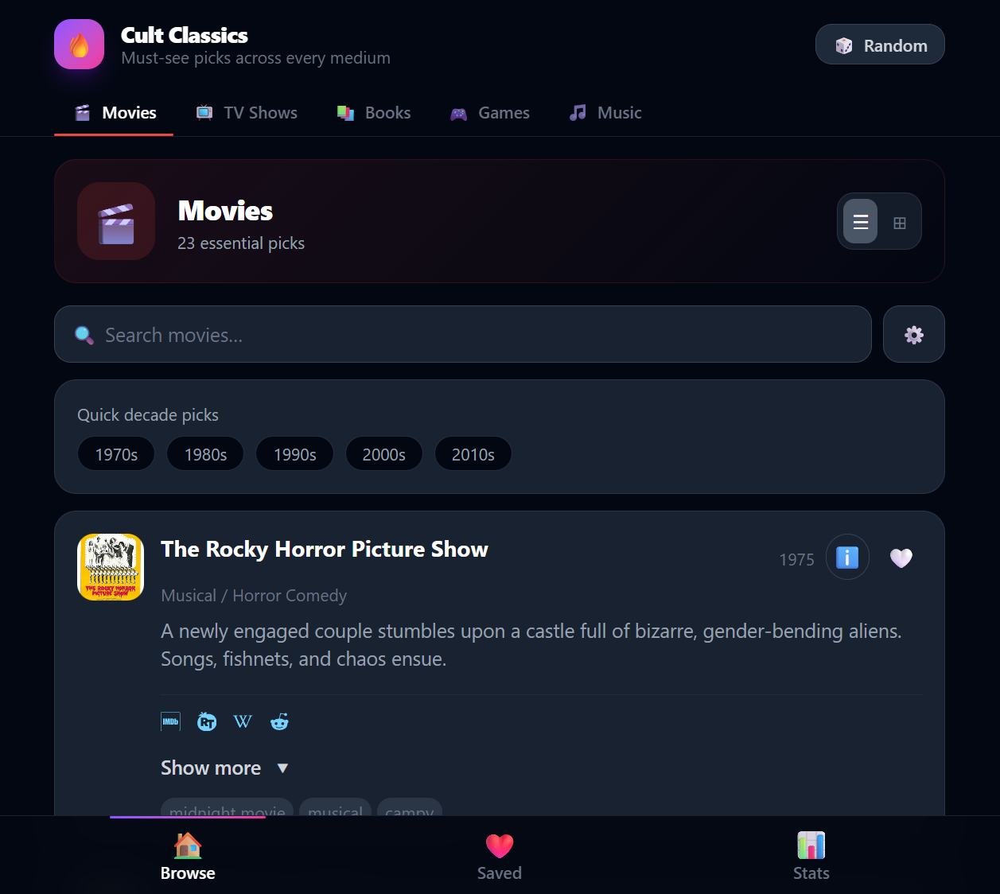

# Cult Classics

A responsive React + Vite app for browsing curated cult classic movies, TV shows, books, games, and music.



## Features

- Browse five categories of cult classics: **Movies**, **TV**, **Books**, **Games**, and **Music**
- Search, sort, and filter by decade
- Open item details in a modal with cover art, rating, genre, description, tags, and "why it's a cult classic"
- Save favorites and keep notes using local persistence
- View favorites and stats for saved items
- Responsive styling with Tailwind CSS

## Getting Started

```bash
npm install
npm run dev
```

Then open the local Vite URL shown in the terminal.

## Scripts

- `npm run dev` — start the development server
- `npm run build` — create a production build
- `npm run preview` — preview the production build locally
- `npm run fetch-images` — fetch artwork image assets via `scripts/fetch-images.js`
- `npm run check-images` — verify image availability via `scripts/check-images.js`

## Project Structure

- `src/` — main application source
- `public/data.json` — cult classics dataset
- `public/screenshot.png` — screenshot shown above
- `scripts/` — data and image helper scripts

## Built With

- React 19
- Vite
- Tailwind CSS
- TypeScript
- `react-icons`, `clsx`, `tailwind-merge`
